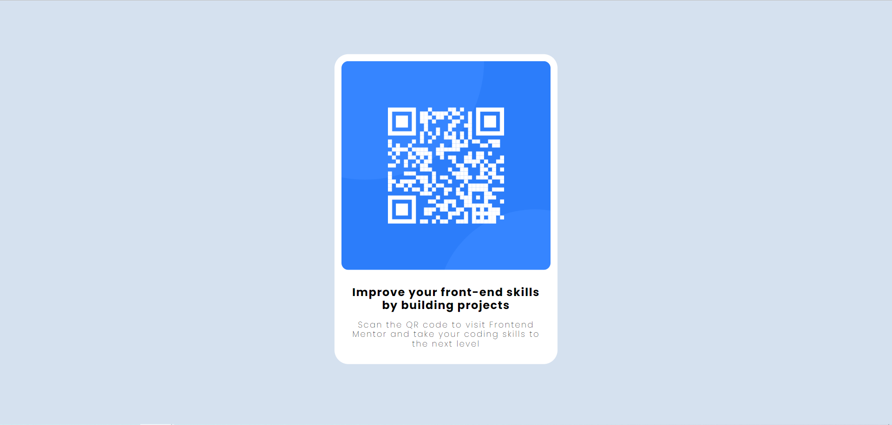

# Frontend Mentor - QR code component solution

This is a solution to the [QR code component challenge on Frontend Mentor](https://www.frontendmentor.io/challenges/qr-code-component-iux_sIO_H).

## Table of contents

- [Overview](#overview)
  - [Screenshot](#screenshot)
  - [Links](#links)
- [My process](#my-process)
  - [Built with](#built-with)
  - [What I learned](#what-i-learned)
  - [Useful resources](#useful-resources)
- [Author](#author)

## Overview

I created a component striving to be most close possibly to the requested design.

### Screenshot

### Links

- Solution URL: [Github Repository](https://github.com/Unidade/qr-code-component-main)
- Live Site URL: [Github Pages](https://unidade.github.io/qr-code-component-main/)

## My process

### Built with

- Semantic HTML5 markup
- SASS

### What I learned

- Improve my skill to identify design by eye.
- Git workflow
- How to host a basic website

### Useful resources

- [Image Color Picker](https://imagecolorpicker.com/en) - This helped me identify the background color.

## Author

- Github - [Unidade](https://www.your-site.com)
- Frontend Mentor - [@Unidade](https://www.frontendmentor.io/profile/Unidade)
